# VGM Core Geo — Presentación de producto

> Documento para reunión de equipo. Resume la propuesta de valor completa y la funcionalidad planificada.

---

## El problema que resolvemos

Las empresas de distribución y ventas no saben realmente qué hace su equipo en campo.

> *"¿El vendedor fue al cliente o dijo que fue?"*
> *"¿Por qué este repartidor tardó 4 horas en una vuelta de 2?"*
> *"¿Cuántos clientes visitamos hoy en la zona norte?"*

**Ultra GEO** — el sistema actual — intenta responder esto pero tiene crashes diarios, no tiene historial de trayectorias, depende de Google Maps (costoso) y no puede evolucionar.

**VGM Core Geo** es el reemplazo completo, construido para durar.

---

## Para quién es

```
┌─────────────────────────────────────────────────────────────┐
│                    Cliente de VGM Core Geo                   │
│                                                             │
│  👔 Gerente          📋 Supervisor         📱 Vendedor      │
│  Ve KPIs globales    Monitorea su equipo   Usa GEMA         │
│  por empresa         en tiempo real        (no usa Geo)     │
└─────────────────────────────────────────────────────────────┘
```

El vendedor/repartidor **no cambia nada** — sigue usando GEMA como hoy.
El valor es para quien **supervisa y gestiona**.

---

## Las 6 funcionalidades principales

---

### 1. Mapa en tiempo real

Ver dónde está cada empleado **ahora mismo**, con su estado.

```
┌─────────────────────────────────────────────────────┐
│                    MAPA                              │
│                                                     │
│   🟢 Juan Pérez      EN_RUTA       hace 45 seg      │
│   🔵 María López     VISITANDO     Almacén García   │
│   🟠 Carlos Ruiz     DETENIDO      25 min parado    │
│   🔴 Pedro Silva     SIN_SEÑAL     hace 18 min      │
│                                                     │
└─────────────────────────────────────────────────────┘
```

**Estados posibles del empleado:**

| Color | Estado | Qué significa |
|---|---|---|
| 🟢 Verde | EN_RUTA | En movimiento hacia un cliente |
| 🔵 Azul | VISITANDO | Dentro del radio de un punto de venta |
| 🟠 Naranja | DETENIDO | Parado fuera de un cliente, < 30 min |
| ⚫ Gris | INACTIVO | Parado fuera de un cliente, > 30 min |
| 🔴 Rojo | SIN_SEÑAL | No recibimos señal hace más de 15 min |

---

### 2. Historial y replay de trayectorias

Ver el recorrido completo de cualquier empleado en cualquier fecha pasada.

**Timeline del día** — el recorrido como una historia:

```
08:45  🚀 Salió de Sucursal Centro
09:12  📍 Llegó a Supermercado Don Mario      ─── estuvo 22 min
09:34  🚗 En ruta
10:05  📍 Llegó a Almacén López               ─── estuvo 8 min
10:15  ⏸  Detenido en Av. Belgrano 1234       ─── 38 min ⚠️
10:53  🚗 En ruta
11:20  📍 Llegó a Despensa El Trébol          ─── estuvo 15 min
...
18:30  📵 Sin señal
─────────────────────────────────────────────────────────────
       🗺️  127 km recorridos  │  9 visitas  │  6:45 en campo
```

**Replay animado:** reproducir el recorrido en el mapa como un video, con control de velocidad.

---

### 3. Visitas detectadas automáticamente ⭐ diferenciador clave

El sistema detecta automáticamente cuándo un empleado visita un punto de venta.
**Sin que el empleado haga nada.** Solo por posición GPS.

**Cómo funciona:**
- Si el empleado está a menos de 100 metros de un punto de venta por más de 3 minutos → visita confirmada
- Si estuvo menos de 3 minutos → visita descartada (pasó de largo)
- Los umbrales son configurables

**Vista de cobertura del día:**

```
Sucursal Centro — Lunes 16/03  ●●●●●●●●●○○○  8/12 puntos visitados (67%)

✅ Supermercado Don Mario     09:12  22 min
✅ Almacén López              10:05   8 min  ⚠️ visita corta
✅ Despensa El Trébol         11:20  15 min
✅ Kiosco Hernández           12:10  12 min
✅ Supermercado El Sol        14:30  31 min
✅ Almacén Rodríguez          15:45   9 min
✅ Verdulería Central         16:20  18 min
✅ Kiosco Norte               17:05   6 min
❌ Minimercado San Martín     — no visitado
❌ Almacén Gómez              — no visitado
❌ Kiosco Belgrano            — no visitado
❌ Despensa La Paz            — no visitado
```

---

### 4. Alertas y eventos

El sistema detecta situaciones anómalas y las registra.

| Alerta | Cuándo se genera |
|---|---|
| ⏸ **Inactividad** | Empleado parado fuera de un cliente por más de 30 min |
| 📵 **Sin señal** | No se reciben posiciones hace más de 15 min |
| 🗺️ **Fuera de zona** | El empleado salió de su territorio asignado |
| ⚡ **Visita muy corta** | Estuvo menos del tiempo mínimo en un punto de venta |
| 🕐 **Inicio tardío** | No apareció señal antes de la hora configurada |

Todos los eventos quedan registrados con fecha y hora para análisis posterior.

---

### 5. Zonas geográficas

Definir territorios de venta dibujando polígonos directamente en el mapa.

```
┌─────────────────────────────────────────────────────┐
│                    MAPA                              │
│    ┌────────────────┐                               │
│    │  Zona Norte    │  👤 Juan Pérez               │
│    │  (polígono)    │  👤 María López              │
│    └────────────────┘                               │
│         ┌──────────────────┐                        │
│         │   Zona Centro    │  👤 Carlos Ruiz        │
│         │   (polígono)     │                        │
│         └──────────────────┘                        │
└─────────────────────────────────────────────────────┘
```

- Se dibujan haciendo click en el mapa
- Se asignan empleados a cada zona
- El sistema detecta cuando un empleado sale de su zona → alerta
- Útil para analizar cobertura por territorio

---

### 6. Dashboard de KPIs

Métricas del trabajo en campo, por empleado y por sucursal.

**Por empleado (día a día):**

```
Juan Pérez — 16/03/2026
────────────────────────────────────────
Cobertura     ████████░░  8/12  (67%)
Km recorridos             127 km
Tiempo en campo           6h 45min
Tiempo en movimiento      4h 20min
Tiempo detenido           2h 25min
Visitas confirmadas       8
Visitas descartadas       3
```

**Por sucursal:**
- Ranking de empleados por cobertura
- Puntos de venta que llevan más de N días sin visita
- Evolución semanal / mensual
- Exportación a Excel / CSV

---

## Fuentes de datos soportadas

VGM Core Geo recibe posiciones de **cualquier origen** — todo entra por el mismo endpoint:

```
┌──────────────┐
│ 📱 App GEMA   │──┐
├──────────────┤  │
│ 🔄 Bridge     │──┤
│    VGMDIS    │  │         ┌─────────────────────┐
├──────────────┤  ├────────▶│  POST /posiciones   │──▶ Base de datos
│ 📡 GPS        │──┤         │  (API Key por origen)│
│    Tracker   │  │         └─────────────────────┘
├──────────────┤  │
│ 🔌 Sistema   │──┤
│    externo   │  │
├──────────────┤  │
│ 📂 Archivo   │──┘
│    CSV/GPX   │
└──────────────┘
```

---

## Lo que nos diferencia de Ultra GEO

| Funcionalidad | Ultra GEO | VGM Core Geo |
|---|---|---|
| Mapa en tiempo real | ✅ básico | ✅ con estados |
| Historial de trayectorias | ❌ código comentado | ✅ completo + replay |
| Timeline del día | ❌ | ✅ |
| Detección automática de visitas | ❌ | ✅ |
| Cobertura de puntos de venta | ❌ | ✅ |
| Alertas | ❌ | ✅ |
| Zonas geográficas | básico | ✅ editor en mapa |
| Dashboard de KPIs | ❌ | ✅ |
| Exportación | ❌ | ✅ (Etapa 2) |
| Mapas | Google Maps 💰 | OpenStreetMap gratis |
| Estabilidad | Crashes diarios | Stack moderno |
| Múltiples fuentes GPS | parcial | ✅ cualquier origen |

---

## Roadmap — qué construimos primero

```mermaid
graph LR
    subgraph etapa1 [Etapa 1 — Reemplazo + diferenciadores]
        A[Mapa\ntiempo real]
        B[Historial\ntrayectorias]
        C[Visitas\ndetectadas ⭐]
        D[Alertas\nbásicas]
        E[Zonas\ngeográficas]
        F[Dashboard\ncobertura]
        G[ABM\ncompleto]
        H[API\ningesta]
    end

    subgraph etapa2 [Etapa 2 — Funcionalidades avanzadas]
        I[Notificaciones\nemail / push]
        J[KPIs\navanzados]
        K[Exportación\nExcel / PDF]
        L[Auth0\nSSO]
        M[Integración\nVGM Core]
    end

    subgraph etapa3 [Etapa 3 — Premium]
        N[Optimización\nde rutas]
        O[Planificación\nde visitas]
        P[API pública]
    end

    etapa1 --> etapa2 --> etapa3

    style etapa1 fill:#dcfce7,stroke:#22c55e
    style etapa2 fill:#dbeafe,stroke:#3b82f6
    style etapa3 fill:#fef9c3,stroke:#eab308
```



---

## Arquitectura en una slide

```
                        VGM Core Geo

┌──────────────────────────────────────────────────────────────┐
│                                                              │
│   FRONTEND (React + TypeScript + Leaflet + OpenStreetMap)   │
│   ┌──────────┐  ┌──────────┐  ┌──────────┐  ┌──────────┐  │
│   │  Mapa    │  │Historial │  │ Visitas  │  │Dashboard │  │
│   │en tiempo │  │    y     │  │detecta-  │  │   KPIs   │  │
│   │  real    │  │ Replay   │  │   das    │  │          │  │
│   └──────────┘  └──────────┘  └──────────┘  └──────────┘  │
│                                                              │
├──────────────────────────────────────────────────────────────┤
│                                                              │
│   BACKEND (Kotlin + Spring Boot + PostgreSQL 17)            │
│   ┌──────────┐  ┌──────────┐  ┌──────────┐  ┌──────────┐  │
│   │Seguridad │  │Posiciones│  │ Visitas  │  │  Admin   │  │
│   │ tenancy  │  │ ingesta  │  │ alertas  │  │  CRUD    │  │
│   │  + JWT   │  │  + API   │  │  zonas   │  │          │  │
│   └──────────┘  └──────────┘  └──────────┘  └──────────┘  │
│                                                              │
├──────────────────────────────────────────────────────────────┤
│                                                              │
│   DATOS                                                      │
│   ┌──────────────────────────────────────────────────────┐  │
│   │  PostgreSQL 17 — base de datos propia                │  │
│   │  clientes_saas → empresas → sucursales               │  │
│   │  empleados / posiciones / visitas / zonas / eventos  │  │
│   └──────────────────────────────────────────────────────┘  │
│                                                              │
└──────────────────────────────────────────────────────────────┘

         ↕ REST API (nunca base de datos compartida)

┌──────────────┐    ┌──────────────┐    ┌──────────────────┐
│  VGM Core    │    │  VGM GEMA    │    │  VGMDIS legacy   │
│  (por Mauri) │    │  Android app │    │  PowerBuilder    │
└──────────────┘    └──────────────┘    └──────────────────┘
```

---

## Stack tecnológico — idéntico a VGM Core

| Capa | Tecnología | Nota |
|---|---|---|
| Backend | Kotlin 2.1 + Spring Boot 3.5 | Igual que VGM Core |
| Base de datos | PostgreSQL 17 | Propia, sin compartir |
| Frontend | React 18 + TypeScript 5 | — |
| Mapas | Leaflet.js + OpenStreetMap | Sin costo de licencia |
| Autenticación | JWT propio → Auth0 (Etapa 2) | Igual que VGM Core |
| CI/CD | GitHub Actions + Docker | Igual que VGM Core |

**Ventaja:** el equipo ya conoce el stack por VGM Core. Los componentes de seguridad (tenancy, filtros, manejo de errores) se copian directamente del trabajo de Mauricio.
